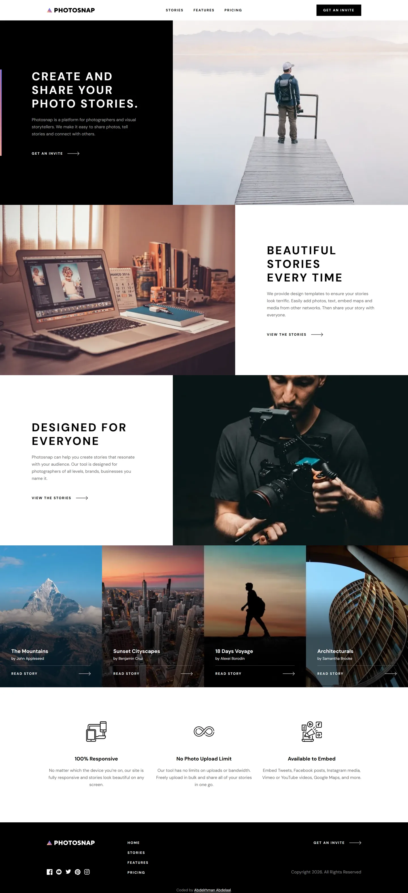

# Photosnap multi-page website

My solution to the [Photosnap multi-page website](https://www.frontendmentor.io/challenges/photosnap-multipage-website-nMDSrNmNW)
challenge on Frontend Mentor.

- Live: https://photosnap-multi-page-website.abdelrhman-ahmed8881.workers.dev
- Code: https://github.com/MrBlackvanta/photosnap-multi-page-website

## Built with

- Next.js 16, App Router, static export
- React 19 and TypeScript
- Tailwind CSS v4

## Notes

### Colour and contrast

One deviation. The pricing toggle's inactive label is `#000000` at 50% in the design, which
composites to 3.95:1. It reads as large text but isn't: WCAG's 3:1 allowance starts at 18.66px
bold and the label is 18px bold, so it owes 4.5:1. It's built at `#757575`, the same grey the
nav hover already uses, at 4.61:1. Hue and saturation are unchanged — it's the smallest step
that passes.

Everything else survives as drawn. The card body at `#000000/60` on `#F5F5F5` is 5.59:1, Pro's
`#FFFFFF/60` on black is 7.37:1, and both were measured by compositing through a canvas rather
than from the flat hex — Tailwind emits those as `oklab(… / 0.6)`, and reading the oklab
components as RGB reports two false failures.

### Where the design frames disagree with each other

- **The billing toggle is centred differently on each breakpoint.** Tablet and mobile centre the
  whole _Monthly · switch · Yearly_ row; desktop centres the switch, which pushes the row 9px
  left because "Monthly" is 18px wider than "Yearly". The row is centred, so tablet and mobile
  land exactly and desktop sits 9.2px right of the frame.
- **The tablet price column is internally misaligned.** "$19.00" ends at x=680 and "per month" at
  x=672, though both are right-aligned text in the same column. Both align to the card's own 40px
  padding at 689.
- **The tablet feature grid is 2-up on Features and 1-up on Home.** Kept as drawn.
- **The container is normalised**: the mobile gutter goes 29 to 33 and the tablet content box 689
  to 690, matching the rest of the site. The desktop compare table is 730 rather than 731 so it
  centres on a whole pixel.

Frontend Mentor's own copy typos are kept as they are, including the pricing hero's opening
clause.

### Markup and behaviour the design doesn't describe

- **Yearly prices are the monthly price times ten.** The design only ever draws monthly and the
  brief says nothing about the toggle, so the number had to come from somewhere; ten months is
  the usual "two months free" convention. It's the one invented value on the site.
- **The price is a CSS counter, so it counts to its new value instead of swapping.** A registered
  `@property --price` typed as `<integer>` is transitionable, `counter-reset` picks it up and a
  `::before` prints `counter(price)`. That makes the digits generated content, so the visible
  number is `aria-hidden` and an `sr-only` "$19.00" sits beside it; the toggle is a
  `role="switch"` and screen readers get "$19.00 per month" either way. Zero JavaScript beyond
  the `useState` that already existed.
- **The compare table keeps explicit ARIA roles.** Mobile restructures it into a feature name
  over three mini-columns, which needs `display: block` on the table — and that silently strips
  the implicit table roles in Chrome and Firefox. With the roles restored the a11y tree still
  reports table / row / rowheader / cell at 375. Each mobile cell carries its plan name as real
  text rather than `aria-hidden` decoration, so a linear read gives "Unlimited story posting →
  Basic Included, Pro Included, Business Included" instead of three bare "Included"s. Column
  widths live on `<col>`, which table layout honours and the mobile block layout ignores.
- **Each "Pick plan" link carries an `sr-only` plan name**, so three links to the same target
  don't share one accessible name.
- **The mobile menu locks the page behind it** — it sets `overflow: hidden` on the body, restores
  the previous value rather than assuming `visible`, marks the content behind it `inert`, and
  closes itself on a `matchMedia` change at the desktop breakpoint so a rotate can't strand the
  lock. `html { overflow-y: scroll }` reserves the scrollbar site-wide, so navigating between a
  short route and a tall one doesn't shift centred content sideways.

### Motion

The pages run 2.1 to 9 viewports deep, so they get restrained reveals rather than a showpiece —
translate only, no fades, and nothing above the fold.

|          | 412x823    | 768x1024   | 1440x940   |
| -------- | ---------- | ---------- | ---------- |
| Home     | 5168 (6.3) | 4223 (4.1) | 3147 (3.3) |
| Stories  | 7423 (9.0) | 5006 (4.9) | 2971 (3.2) |
| Features | 3312 (4.0) | 2210 (2.2) | 1987 (2.1) |
| Pricing  | 3978 (4.8) | 3057 (3.0) | 2738 (2.9) |

The hero's gradient bar draws itself in on load, along its own axis at each breakpoint. Story
cards, feature tiles, the comparison table and the beta banner rise 12px on a `view()` timeline.
There is no JavaScript behind any of it and no observer, so every static section stays a server
component.

**Opacity is deliberately not animated.** Lighthouse scrolls the whole page during its run, so
axe samples elements partway through their range and reads half-faded text as a contrast failure.
A translate-only reveal is also never invisible, only offset.

Both guards matter more than the effect: `prefers-reduced-motion: no-preference` and
`@supports (animation-timeline: view())`. A browser without view timelines never applies the rule
at all, and a timeline whose subject is out of range is inactive, so content renders at rest
rather than hidden. Ranges are written as lengths — `entry 0px entry 120px` — not percentages, so
they don't shorten as the window grows; every reveal was checked to reach progress 1.000 at
maximum scroll at 800, 940 and 1200px window heights on all four pages.

The plans section is the one group that isn't revealed: it sits inside the first viewport at
every width. A group that straddles the fold at load starts partly through its range, and the
worst case measured is 8.2px on the Features grid's first row at 768x1024, where 30px of that row
is on screen; everywhere else it's under 4.2px, and Home and Pricing are exactly zero at every
height tested. The offset is largest precisely where the element is least visible, and it settles
within 120px of scroll.

### Performance

Images are WebP throughout, art-directed with `<picture>` against Frontend Mentor's own three
crops rather than resampled from one. Every image carries `width` and `height`; the hero is
`eager` and `fetchpriority="high"` and everything else is `lazy`.

`experimental.inlineCss` is on. It trades a stylesheet request for a bigger document, and which
way that goes depends on how much of the page is above the fold, so it's worth measuring per
project rather than assuming.

## Author

- [LinkedIn](https://www.linkedin.com/in/abdelrhman-vanta/)
- [UpWork](https://www.upwork.com/freelancers/mrblackvanta)
- [Frontend Mentor](https://www.frontendmentor.io/profile/MrBlackvanta)
